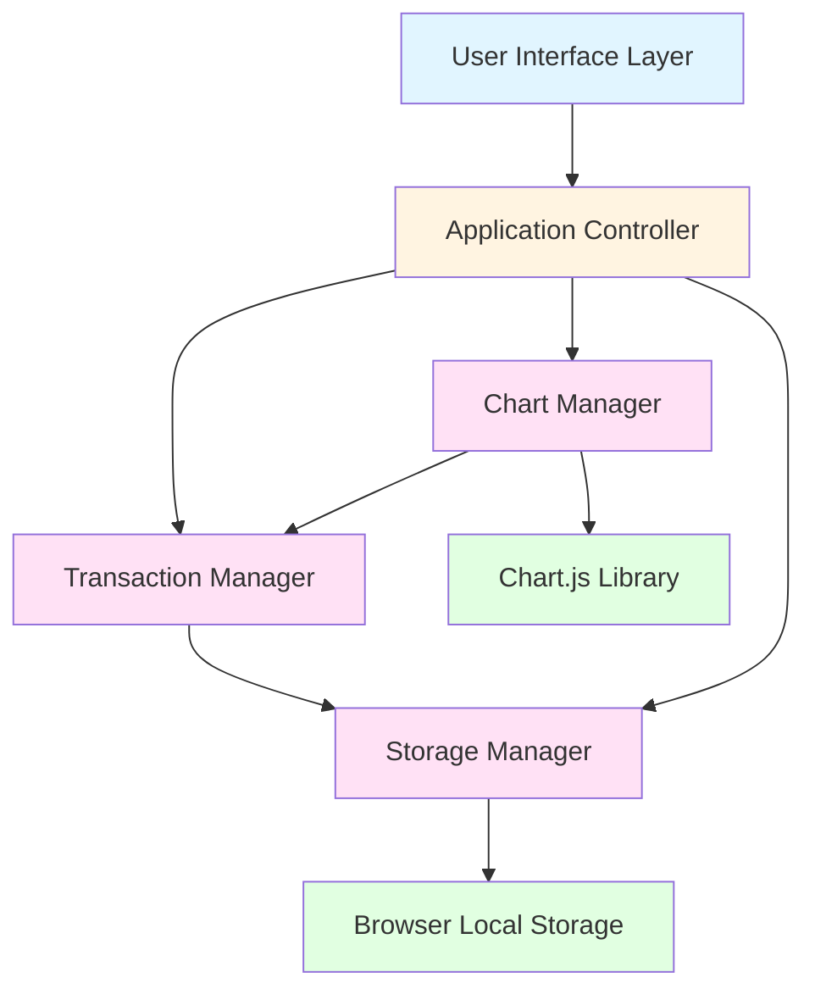
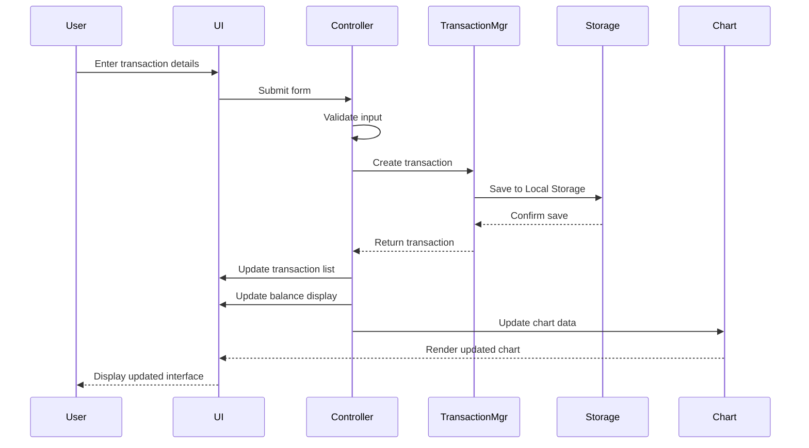
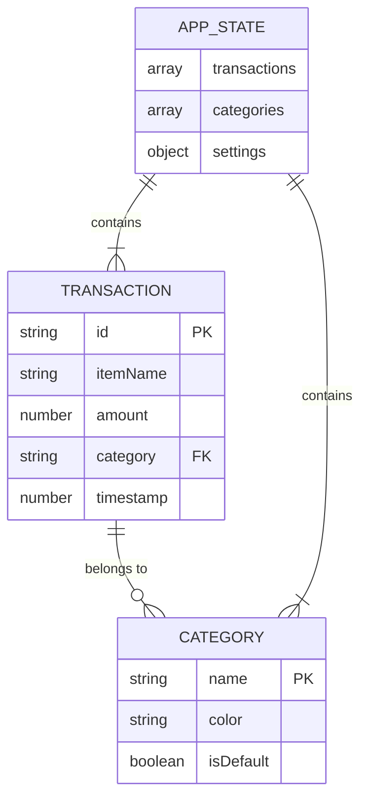

# Design Document: Expense & Budget Visualizer

## Overview

The Expense & Budget Visualizer is a client-side web application that provides users with an intuitive interface for tracking daily expenses. The application follows a simple, single-page architecture where all functionality is contained within one HTML page, styled with CSS, and powered by vanilla JavaScript.

### Key Design Principles

1. **Simplicity First**: No frameworks, no build tools, no backend - just HTML, CSS, and JavaScript
2. **Client-Side Only**: All data storage and processing happens in the browser using Local Storage
3. **Mobile-First Responsive**: Designed primarily for mobile devices with desktop support
4. **Immediate Feedback**: All UI updates happen synchronously with user actions
5. **Progressive Enhancement**: Core functionality works first, optional features enhance the experience

### Architecture Style

The application uses a **Model-View-Controller (MVC)** pattern implemented in vanilla JavaScript:
- **Model**: Transaction data stored in Local Storage
- **View**: DOM manipulation for rendering UI components
- **Controller**: Event handlers and business logic coordinating between model and view

## Architecture

### System Architecture Diagram



### Component Architecture

The application is organized into distinct functional modules:

1. **UI Layer**
   - Input Form Component
   - Transaction List Component
   - Balance Display Component
   - Chart Component
   - Optional Feature Components (Theme Toggle, Sorting Controls, etc.)

2. **Business Logic Layer**
   - Transaction Manager: CRUD operations for transactions
   - Validation Module: Input validation and error handling
   - Calculation Module: Balance and category aggregation
   - Chart Manager: Data transformation for visualization

3. **Data Layer**
   - Storage Manager: Abstraction over Local Storage API
   - Data Models: Transaction and Category structures

### File Structure

```
expense-budget-visualizer/
├── index.html              # Main HTML file
├── css/
│   └── styles.css         # All application styles
└── js/
    └── app.js             # All application logic
```

### Data Flow



## Components and Interfaces

### 1. Transaction Manager

**Responsibility**: Manages all transaction-related operations

**Interface**:
```javascript
class TransactionManager {
  constructor(storageManager)
  
  // Core operations
  addTransaction(itemName, amount, category) -> Transaction
  deleteTransaction(transactionId) -> boolean
  getAllTransactions() -> Transaction[]
  
  // Calculations
  calculateTotalBalance() -> number
  getCategoryTotals() -> Map<string, number>
}
```

**Key Methods**:
- `addTransaction()`: Validates input, creates transaction object, persists to storage
- `deleteTransaction()`: Removes transaction by ID, updates storage
- `getAllTransactions()`: Retrieves all transactions from storage
- `calculateTotalBalance()`: Sums all transaction amounts
- `getCategoryTotals()`: Aggregates spending by category for chart rendering

### 2. Storage Manager

**Responsibility**: Abstracts Local Storage operations and handles serialization

**Interface**:
```javascript
class StorageManager {
  constructor(storageKey)
  
  // Storage operations
  save(data) -> void
  load() -> any
  clear() -> void
  
  // Specific operations
  saveTransactions(transactions) -> void
  loadTransactions() -> Transaction[]
}
```

**Key Methods**:
- `save()`: Serializes data to JSON and stores in Local Storage
- `load()`: Retrieves and deserializes data from Local Storage
- Error handling for quota exceeded and corrupted data

### 3. Chart Manager

**Responsibility**: Manages Chart.js integration and data visualization

**Interface**:
```javascript
class ChartManager {
  constructor(canvasElement)
  
  // Chart operations
  initialize() -> void
  updateChart(categoryData) -> void
  destroy() -> void
  showEmptyState() -> void
}
```

**Key Methods**:
- `initialize()`: Creates Chart.js instance with configuration
- `updateChart()`: Updates chart with new category totals
- `showEmptyState()`: Displays message when no data exists
- Handles chart destruction and recreation for updates

### 4. UI Controller

**Responsibility**: Coordinates between UI events and business logic

**Interface**:
```javascript
class UIController {
  constructor(transactionManager, chartManager)
  
  // Initialization
  initialize() -> void
  
  // Event handlers
  handleFormSubmit(event) -> void
  handleDeleteTransaction(transactionId) -> void
  
  // UI updates
  renderTransactionList() -> void
  updateBalanceDisplay() -> void
  showValidationError(message) -> void
  clearForm() -> void
}
```

**Key Methods**:
- `initialize()`: Sets up event listeners and loads initial data
- `handleFormSubmit()`: Processes form submission, validates, and updates UI
- `handleDeleteTransaction()`: Removes transaction and refreshes UI
- `renderTransactionList()`: Generates HTML for all transactions
- `updateBalanceDisplay()`: Updates total balance in UI

### 5. Validation Module

**Responsibility**: Validates user input before processing

**Interface**:
```javascript
class ValidationModule {
  static validateTransaction(itemName, amount, category) -> ValidationResult
  static validateAmount(amount) -> boolean
  static validateItemName(itemName) -> boolean
  static validateCategory(category) -> boolean
}
```

**Validation Rules**:
- Item name: Non-empty string, max 100 characters
- Amount: Positive number, max 2 decimal places
- Category: Must be from allowed list (Food, Transport, Fun, or custom)

### Component Interaction Patterns

**Adding a Transaction**:
1. User fills form and clicks submit
2. UIController captures event
3. ValidationModule validates input
4. If valid: TransactionManager creates and stores transaction
5. UIController updates all UI components (list, balance, chart)
6. Form is cleared for next entry

**Deleting a Transaction**:
1. User clicks delete button on transaction
2. UIController captures event with transaction ID
3. TransactionManager removes transaction from storage
4. UIController updates all UI components

**Loading Application**:
1. Page loads, UIController initializes
2. StorageManager loads transactions from Local Storage
3. UIController renders initial state (list, balance, chart)
4. Event listeners are attached

## Data Models

### Transaction Model

```javascript
class Transaction {
  id: string              // UUID v4 or timestamp-based unique ID
  itemName: string        // Name of the expense item
  amount: number          // Expense amount (positive number)
  category: string        // Category name (Food, Transport, Fun, or custom)
  timestamp: number       // Unix timestamp of creation
  
  constructor(itemName, amount, category)
  toJSON() -> object
  static fromJSON(json) -> Transaction
}
```

**Field Specifications**:
- `id`: Generated using `crypto.randomUUID()` or `Date.now() + Math.random()`
- `itemName`: String, 1-100 characters, trimmed
- `amount`: Number, positive, up to 2 decimal places
- `category`: String, must match available categories
- `timestamp`: Number, milliseconds since epoch

**Example**:
```json
{
  "id": "550e8400-e29b-41d4-a716-446655440000",
  "itemName": "Lunch at cafe",
  "amount": 15.50,
  "category": "Food",
  "timestamp": 1704067200000
}
```

### Category Model

```javascript
class Category {
  name: string           // Category name
  color: string          // Hex color for chart display
  isDefault: boolean     // Whether it's a default category
  
  constructor(name, color, isDefault)
}
```

**Default Categories**:
```javascript
const DEFAULT_CATEGORIES = [
  { name: "Food", color: "#FF6384", isDefault: true },
  { name: "Transport", color: "#36A2EB", isDefault: true },
  { name: "Fun", color: "#FFCE56", isDefault: true }
];
```

### Application State Model

```javascript
class AppState {
  transactions: Transaction[]
  categories: Category[]
  settings: {
    theme: string              // 'light' or 'dark'
    spendingLimit: number      // Optional spending limit
    sortOrder: string          // 'date', 'amount', 'category'
  }
}
```

### Local Storage Schema

**Key**: `expense-tracker-data`

**Structure**:
```json
{
  "version": "1.0",
  "transactions": [
    {
      "id": "uuid",
      "itemName": "string",
      "amount": 0.00,
      "category": "string",
      "timestamp": 0
    }
  ],
  "categories": [
    {
      "name": "string",
      "color": "#hex",
      "isDefault": false
    }
  ],
  "settings": {
    "theme": "light",
    "spendingLimit": null,
    "sortOrder": "date"
  }
}
```

**Storage Considerations**:
- Local Storage limit: ~5-10MB depending on browser
- Data is stored as JSON string
- Version field allows for future schema migrations
- Corrupted data handling: Clear and reinitialize if parse fails

### Data Relationships



## UI/UX Design

### Layout Structure

```
┌─────────────────────────────────────┐
│         Header / Title              │
├─────────────────────────────────────┤
│                                     │
│      Balance Display (Large)        │
│                                     │
├─────────────────────────────────────┤
│                                     │
│         Input Form                  │
│  [Item Name]  [Amount]  [Category]  │
│           [Add Button]              │
│                                     │
├─────────────────────────────────────┤
│                                     │
│      Chart Component (Pie)          │
│                                     │
├─────────────────────────────────────┤
│                                     │
│     Transaction List (Scrollable)   │
│  • Item 1    $10.00    [Delete]     │
│  • Item 2    $25.50    [Delete]     │
│  • Item 3    $8.75     [Delete]     │
│                                     │
└─────────────────────────────────────┘
```

### Component Specifications

#### 1. Balance Display
- **Position**: Top of page, prominent placement
- **Typography**: Large font size (2-3rem), bold weight
- **Format**: Currency symbol + amount with 2 decimal places
- **Color**: Dynamic based on spending limit (if enabled)
- **Animation**: Smooth number transition on updates

#### 2. Input Form
- **Layout**: Horizontal on desktop, stacked on mobile
- **Fields**:
  - Item Name: Text input, placeholder "e.g., Coffee"
  - Amount: Number input, placeholder "0.00", step="0.01"
  - Category: Dropdown select with default options
- **Button**: Primary action button, full width on mobile
- **Validation**: Inline error messages below fields

#### 3. Transaction List
- **Container**: Scrollable div with max-height
- **Item Layout**: Flexbox with space-between
  - Left: Item name + category badge
  - Right: Amount + delete button
- **Empty State**: Centered message "No transactions yet"
- **Scroll**: Smooth scrolling, latest items at top or bottom (configurable)

#### 4. Chart Component
- **Type**: Pie chart (Chart.js)
- **Size**: Responsive, max 400px width
- **Legend**: Show category names and percentages
- **Colors**: Match category colors from data model
- **Empty State**: Placeholder graphic or message

### Responsive Design Breakpoints

```css
/* Mobile First */
/* Base styles: 320px - 767px */

/* Tablet */
@media (min-width: 768px) {
  /* Adjust form to horizontal layout */
  /* Increase chart size */
}

/* Desktop */
@media (min-width: 1024px) {
  /* Two-column layout: Chart + List side by side */
  /* Wider form fields */
}
```

### Color Scheme

**Light Theme** (Default):
- Background: `#f5f5f5`
- Card Background: `#ffffff`
- Primary: `#4CAF50`
- Text: `#333333`
- Border: `#e0e0e0`

**Dark Theme** (Optional):
- Background: `#1a1a1a`
- Card Background: `#2d2d2d`
- Primary: `#66BB6A`
- Text: `#e0e0e0`
- Border: `#404040`

### Typography

- **Font Family**: System font stack for performance
  ```css
  font-family: -apple-system, BlinkMacSystemFont, "Segoe UI", Roboto, 
               "Helvetica Neue", Arial, sans-serif;
  ```
- **Font Sizes**:
  - Heading: 1.5rem - 2rem
  - Balance: 2.5rem - 3rem
  - Body: 1rem
  - Small: 0.875rem

### Interaction Design

**Form Submission**:
1. User fills fields
2. Click "Add" button or press Enter
3. If invalid: Show error message, highlight field
4. If valid: Clear form, show success feedback (optional), update UI

**Transaction Deletion**:
1. User clicks delete icon/button
2. Optional: Show confirmation dialog
3. Remove transaction with fade-out animation
4. Update balance and chart

**Chart Interaction**:
- Hover: Show exact amount for category
- Click: Optional filter transactions by category

### Accessibility Considerations

- Semantic HTML elements (`<form>`, `<button>`, `<input>`)
- ARIA labels for icon buttons
- Keyboard navigation support
- Focus indicators on interactive elements
- Sufficient color contrast (WCAG AA minimum)
- Screen reader announcements for dynamic updates

## Implementation Approach

### Development Phases

**Phase 1: Core Functionality** (MVP)
1. Set up HTML structure and basic CSS
2. Implement Transaction Manager and Storage Manager
3. Build input form with validation
4. Create transaction list rendering
5. Implement balance calculation and display
6. Add delete functionality

**Phase 2: Visualization**
1. Integrate Chart.js library
2. Implement Chart Manager
3. Connect chart updates to transaction changes
4. Style chart component

**Phase 3: Polish & Testing**
1. Responsive design refinement
2. Cross-browser testing
3. Error handling improvements
4. Performance optimization
5. Accessibility audit

**Phase 4: Optional Features** (If time permits)
1. Custom categories
2. Theme toggle
3. Transaction sorting
4. Spending limit alerts
5. Monthly summary view

### Technology Integration

**Chart.js Integration**:
```html
<!-- CDN approach for simplicity -->
<script src="https://cdn.jsdelivr.net/npm/chart.js@4.4.0/dist/chart.umd.min.js"></script>
```

**Local Storage Strategy**:
- Single key for all app data: `expense-tracker-data`
- JSON serialization for complex objects
- Graceful degradation if Local Storage unavailable
- Error handling for quota exceeded

### Code Organization Strategy

**app.js Structure**:
```javascript
// 1. Constants and Configuration
const CONFIG = { ... };
const DEFAULT_CATEGORIES = [ ... ];

// 2. Data Models
class Transaction { ... }
class Category { ... }

// 3. Storage Layer
class StorageManager { ... }

// 4. Business Logic
class TransactionManager { ... }
class ValidationModule { ... }

// 5. UI Layer
class ChartManager { ... }
class UIController { ... }

// 6. Initialization
document.addEventListener('DOMContentLoaded', () => {
  const app = new UIController(...);
  app.initialize();
});
```

### Performance Considerations

1. **DOM Manipulation**: Batch updates, use DocumentFragment for list rendering
2. **Chart Updates**: Debounce rapid updates if needed
3. **Local Storage**: Minimize read/write operations, cache in memory
4. **Event Listeners**: Use event delegation for transaction list
5. **CSS**: Avoid expensive properties, use transforms for animations

### Error Handling Strategy

1. **Input Validation**: Client-side validation before processing
2. **Storage Errors**: Try-catch around Local Storage operations
3. **Chart Errors**: Fallback if Chart.js fails to load
4. **Data Corruption**: Detect and clear corrupted Local Storage data
5. **User Feedback**: Clear error messages in UI

### Browser Compatibility Approach

- Use standard ES6+ features supported by modern browsers
- Avoid experimental APIs
- Test in Chrome, Firefox, Safari, Edge
- Polyfills only if absolutely necessary (prefer feature detection)
- Graceful degradation for unsupported features

### Testing Strategy

Given the nature of this application (UI-heavy with local storage and external library dependencies), property-based testing is **not appropriate** for most functionality. The application involves:
- DOM manipulation and rendering
- User interactions and event handling
- Browser Local Storage API (external dependency)
- Chart.js library integration (external dependency)
- Visual layout and styling

**Testing Approach**:

#### 1. Unit Tests (Example-Based)

**Transaction Manager Tests**:
- Test adding a valid transaction
- Test adding transaction with invalid data
- Test deleting existing transaction
- Test deleting non-existent transaction
- Test calculating balance with multiple transactions
- Test calculating balance with empty list
- Test category totals calculation

**Validation Module Tests**:
- Test valid item names
- Test empty item names
- Test item names exceeding max length
- Test valid amounts (positive, 2 decimals)
- Test invalid amounts (negative, too many decimals, non-numeric)
- Test valid categories
- Test invalid categories

**Storage Manager Tests**:
- Test saving transactions to mock storage
- Test loading transactions from mock storage
- Test handling corrupted JSON data
- Test handling quota exceeded error
- Test clearing storage

#### 2. Integration Tests

**End-to-End Workflows**:
- Add transaction → Verify in list, balance, chart, and storage
- Delete transaction → Verify removal from list, balance, chart, and storage
- Load app with existing data → Verify correct rendering
- Add multiple transactions → Verify correct aggregation

**Chart Integration**:
- Verify Chart.js initializes correctly
- Verify chart updates when data changes
- Verify empty state displays when no data

#### 3. Manual Testing

**Browser Compatibility**:
- Test in Chrome, Firefox, Safari, Edge
- Verify Local Storage works in all browsers
- Verify Chart.js renders correctly

**Responsive Design**:
- Test on mobile devices (320px, 375px, 414px widths)
- Test on tablets (768px, 1024px widths)
- Test on desktop (1280px+ widths)

**User Interactions**:
- Form submission with Enter key
- Form submission with button click
- Delete button functionality
- Input validation error display
- Empty state displays

**Accessibility**:
- Keyboard navigation through form and buttons
- Screen reader announcements (manual testing with NVDA/JAWS)
- Focus indicators visible
- Color contrast meets WCAG AA

#### 4. Performance Testing

- Test with 100+ transactions for list rendering performance
- Test Local Storage with large datasets
- Verify chart updates don't cause lag

#### 5. Error Scenario Testing

- Test with Local Storage disabled
- Test with corrupted Local Storage data
- Test with Chart.js CDN unavailable
- Test with invalid user inputs
- Test with browser storage quota exceeded

**Test Execution**:
- Unit tests: Use a simple test runner (e.g., Jest, Mocha) or manual console testing
- Integration tests: Manual testing or simple test scripts
- Browser tests: Manual testing across target browsers
- Accessibility: Manual testing with assistive technologies

**Why No Property-Based Testing**:
- UI rendering cannot be tested with universal properties
- DOM manipulation is not a pure function
- Local Storage is an external API with side effects
- Chart.js behavior is determined by the library, not our code
- User interactions are event-driven, not input-output functions
- Visual design and layout require human verification

The testing strategy focuses on concrete examples, integration verification, and manual testing to ensure the application works correctly across all requirements.

## Error Handling

### Error Categories and Handling

#### 1. User Input Errors

**Validation Errors**:
- **Empty Fields**: Display inline error "Please fill in all fields"
- **Invalid Amount**: Display "Please enter a valid positive number"
- **Invalid Category**: Display "Please select a category"
- **Item Name Too Long**: Display "Item name must be less than 100 characters"

**Handling Strategy**:
```javascript
try {
  const validation = ValidationModule.validateTransaction(itemName, amount, category);
  if (!validation.isValid) {
    uiController.showValidationError(validation.message);
    return;
  }
  // Proceed with transaction creation
} catch (error) {
  uiController.showValidationError("An unexpected error occurred");
  console.error("Validation error:", error);
}
```

#### 2. Storage Errors

**Local Storage Unavailable**:
- **Detection**: Check `typeof Storage !== 'undefined'`
- **Fallback**: Display warning message, use in-memory storage for session
- **User Message**: "Local storage is unavailable. Your data will not persist."

**Quota Exceeded**:
- **Detection**: Catch `QuotaExceededError` on save
- **Handling**: Prompt user to delete old transactions
- **User Message**: "Storage limit reached. Please delete some transactions."

**Corrupted Data**:
- **Detection**: JSON.parse() throws error
- **Handling**: Clear corrupted data, start fresh
- **User Message**: "Data corruption detected. Starting fresh."

**Handling Strategy**:
```javascript
class StorageManager {
  save(data) {
    try {
      const json = JSON.stringify(data);
      localStorage.setItem(this.storageKey, json);
    } catch (error) {
      if (error.name === 'QuotaExceededError') {
        throw new StorageQuotaError("Storage limit exceeded");
      } else {
        throw new StorageError("Failed to save data");
      }
    }
  }
  
  load() {
    try {
      const json = localStorage.getItem(this.storageKey);
      if (!json) return null;
      return JSON.parse(json);
    } catch (error) {
      console.error("Failed to load data:", error);
      // Clear corrupted data
      this.clear();
      return null;
    }
  }
}
```

#### 3. Chart Rendering Errors

**Chart.js Load Failure**:
- **Detection**: Check if `Chart` is defined
- **Fallback**: Display text-based category summary
- **User Message**: "Chart unavailable. Showing text summary."

**Chart Update Errors**:
- **Handling**: Catch errors during chart update, log to console
- **Fallback**: Destroy and recreate chart
- **User Message**: No message (silent recovery)

**Handling Strategy**:
```javascript
class ChartManager {
  updateChart(categoryData) {
    try {
      if (this.chart) {
        this.chart.data.labels = categoryData.labels;
        this.chart.data.datasets[0].data = categoryData.values;
        this.chart.update();
      }
    } catch (error) {
      console.error("Chart update failed:", error);
      // Attempt recovery
      this.destroy();
      this.initialize();
      this.updateChart(categoryData);
    }
  }
}
```

#### 4. Runtime Errors

**Unexpected Errors**:
- **Global Error Handler**: Catch unhandled errors
- **Logging**: Log to console for debugging
- **User Message**: "Something went wrong. Please refresh the page."

**Handling Strategy**:
```javascript
window.addEventListener('error', (event) => {
  console.error("Unhandled error:", event.error);
  // Display user-friendly error message
  showGlobalError("An unexpected error occurred. Please refresh the page.");
});
```

#### 5. Data Integrity Errors

**Invalid Transaction ID**:
- **Detection**: Transaction not found during delete
- **Handling**: Log warning, no user action needed
- **User Message**: No message (silent failure)

**Category Mismatch**:
- **Detection**: Transaction references non-existent category
- **Handling**: Assign to "Other" category or default
- **User Message**: No message (automatic correction)

### Error Recovery Strategies

1. **Graceful Degradation**: Core functionality works even if optional features fail
2. **Silent Recovery**: Attempt automatic recovery for non-critical errors
3. **User Notification**: Clear messages for errors requiring user action
4. **Data Preservation**: Never lose user data without explicit confirmation
5. **Logging**: Console logging for debugging in development

### Error Message Guidelines

- **Clear**: Use plain language, avoid technical jargon
- **Actionable**: Tell users what they can do to fix the issue
- **Concise**: Keep messages short and to the point
- **Friendly**: Maintain a helpful, non-blaming tone

**Examples**:
- ✅ "Please enter an amount greater than 0"
- ❌ "Invalid input: amount must be positive number"
- ✅ "Storage limit reached. Delete some transactions to continue."
- ❌ "QuotaExceededError: localStorage quota exceeded"

